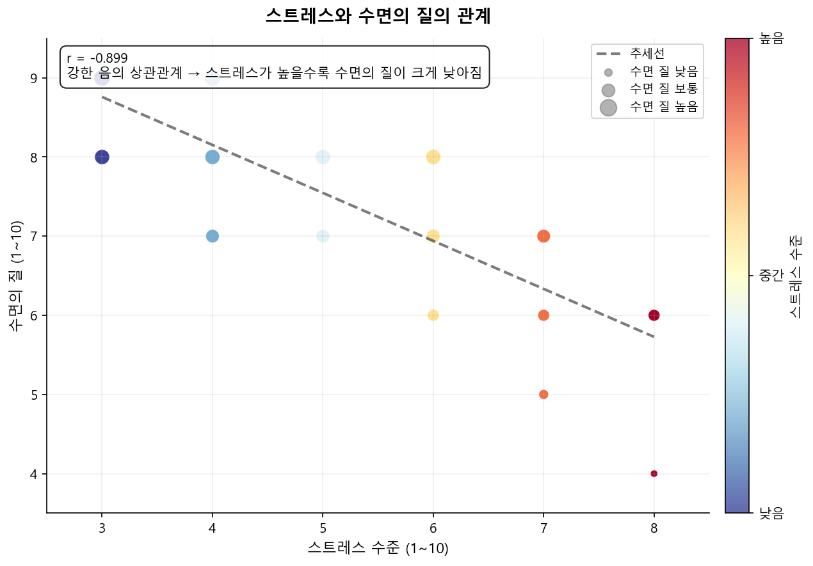
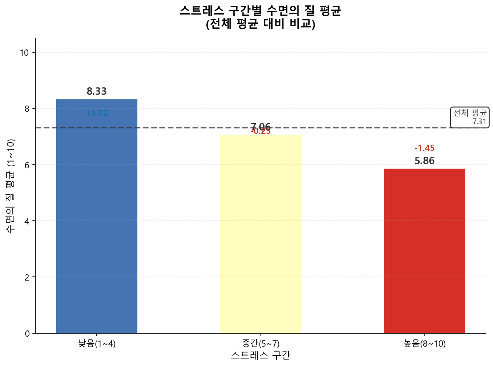
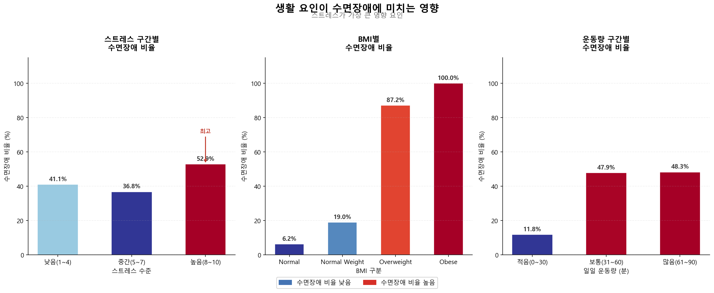
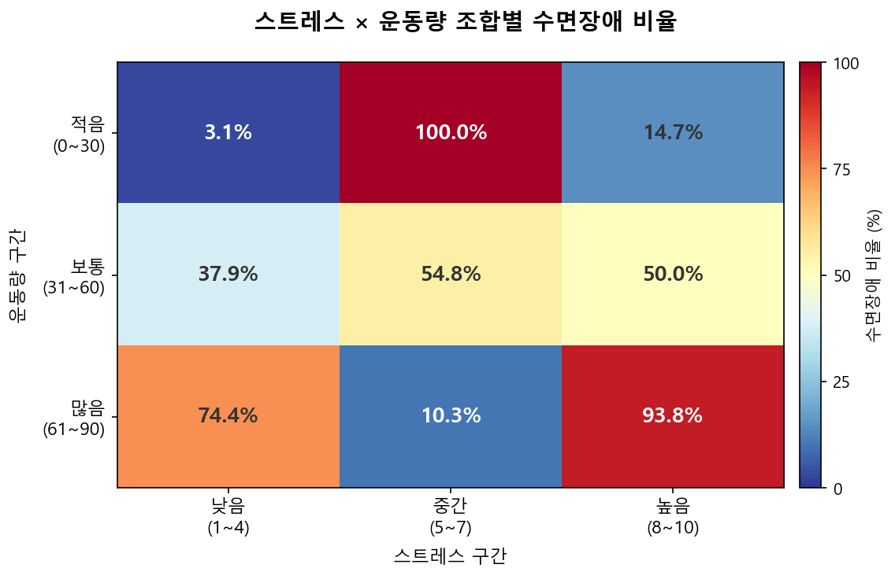
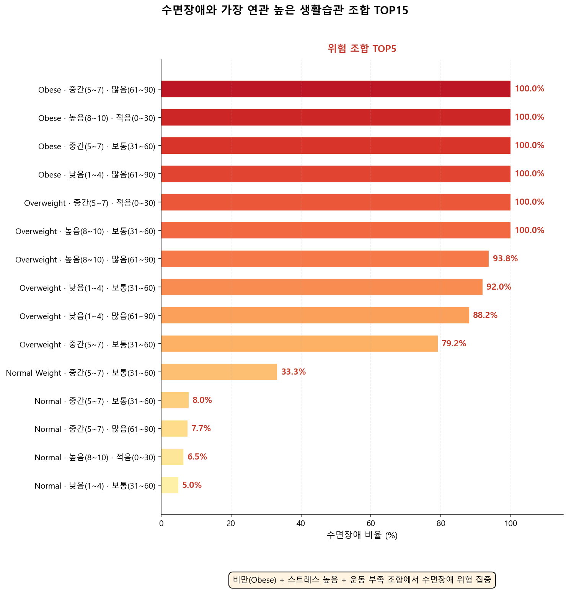

# 💤 수면 및 생활습관 데이터 분석

> 수면 건강 데이터를 분석하여 스트레스·BMI·운동량과 수면장애의 관계를 시각화한 파이썬 프로젝트

---

## 📁 프로젝트 구조

```
sleep/
├── main.py          # 실행 진입점
├── analyzer.py      # 데이터 로드 · 분석
├── Visualizer.py    # 시각화
├── data/
│   └── Sleep_health_and_lifestyle_dataset.csv
└── output/          # 분석 결과 이미지 저장
```

---

## 🛠 기술 스택

| 분류 | 기술 |
|---|---|
| 언어 | Python 3.10+ |
| 데이터 처리 | pandas |
| 시각화 | matplotlib |
| 데이터 출처 | Kaggle — Sleep Health and Lifestyle Dataset |

---

## 📊 데이터셋

- **출처**: [Kaggle - Sleep Health and Lifestyle Dataset](https://www.kaggle.com/datasets/ayeshaimiran1619/sleep-and-lifestyle-study)
- **크기**: 374행 × 13열
- **주요 컬럼**

| 컬럼 | 설명 |
|---|---|
| Sleep Duration | 하루 수면시간 (시간) |
| Quality of Sleep | 수면의 질 (1~10) |
| Stress Level | 스트레스 수준 (1~10) |
| Physical Activity Level | 일일 운동량 (분) |
| BMI Category | BMI 분류 (Normal / Overweight / Obese) |
| Sleep Disorder | 수면장애 여부 (None / Insomnia / Sleep Apnea) |

---

## 🔧 데이터 전처리

1. **결측값 처리** — `Sleep Disorder` 컬럼의 빈 칸을 `"None"` 으로 채움
2. **컬럼 한글화** — 영어 컬럼명을 한글로 변환하여 가독성 향상
3. **구간화** — 스트레스(1~10), 운동량(0~90)을 낮음/중간/높음 구간으로 분류

---

## 🔬 가설 및 분석 질문

### Q1. 스트레스 수준과 수면의 질 사이에 어떤 관계가 있나?

- **가설**: 스트레스가 높을수록 수면의 질이 낮아질 것이다

> **📌 상관관계란?**
> 두 값이 함께 움직이는 정도를 −1 ~ 1 사이 숫자로 표현한 것.
> - **r = -1에 가까울수록** → 한쪽이 오르면 다른 쪽은 내려감 (반비례)
> - **r = 0에 가까울수록** → 두 값 사이에 관계 없음
> - **r = +1에 가까울수록** → 한쪽이 오르면 다른 쪽도 올라감 (비례)
- **분석 방법**
  - 피어슨 상관계수 계산
  - 스트레스 구간별(낮음/중간/높음) 수면의 질 평균 비교
- **시각화**
  - 산점도 (색: 스트레스 낮음→파랑, 높음→빨강 / 점 크기: 수면의 질)
  - 막대그래프 + 전체 평균선

### Q2. 어떤 생활습관 조합이 수면장애와 가장 연관이 높나?

- **가설**: BMI·스트레스·운동량의 조합이 수면장애 발생률에 영향을 미칠 것이다
- **분석 방법**
  - BMI / 스트레스 / 운동량 구간별 수면장애 비율 계산
  - 3가지 요인 조합별 수면장애 비율 비교 (TOP15)
- **시각화**
  - 3개 카드형 패널 (스트레스 / BMI / 운동량)
  - 히트맵 (스트레스 × 운동량 조합)
  - 위험 조합 TOP15 수평 막대그래프

---

## 📈 주요 분석 결과

### Q1 결과
- 상관계수 **r = -0.899** → 강한 음의 상관관계
- 스트레스가 높을수록 수면의 질이 크게 낮아짐

| 스트레스 구간 | 수면의 질 평균 |
|---|---|
| 낮음 (1~4) | 8.33 |
| 중간 (5~7) | 7.06 |
| 높음 (8~10) | 5.86 |




### Q2 결과
- 위험 조합 TOP6이 모두 **Obese(비만)·Overweight(과체중)** 포함
- **BMI가 스트레스·운동량보다 압도적으로 강한 요인**
- 운동을 많이 하고 스트레스가 낮아도 비만이면 수면장애 비율 100%

> 💡 **핵심 인사이트**: 생활습관 조합 중 BMI(비만 여부)가 수면장애의 가장 결정적인 요인





---

## 🚀 실행 방법

```bash
# 1. 레포 클론
git clone https://github.com/mina-401/sleep.git
cd sleep

# 2. 라이브러리 설치
pip install pandas matplotlib

# 3. 실행
python main.py
```

실행 후 `output/` 폴더에 결과 이미지 5개가 저장됩니다.

```
output/
├── q1_scatter.png       # Q1 산점도
├── q1_stress_bar.png    # Q1 스트레스 구간별 막대
├── q2_panels.png        # Q2 3개 패널
├── q2_heatmap.png       # Q2 히트맵
└── q2_top_risk.png      # Q2 위험 조합 TOP15
```

---

## ⚠️ 데이터 한계

- 수면의 질·스트레스가 1~10 **정수값**으로만 기록되어 산점도가 격자 형태로 나타남
- 설문 기반 데이터로 주관적 측정이 포함될 수 있음
- 374명의 소규모 샘플로 일반화에 한계가 있음
